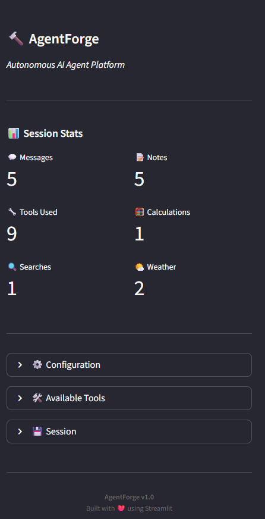
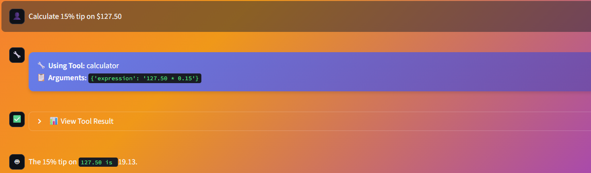

# 🔨 AgentForge

**An Autonomous AI Agent Platform with Tool Use, Memory, and Multi-Step Reasoning**


AgentForge is a powerful AI agent framework that enables Large Language Models to autonomously use tools, maintain conversation memory, and perform complex multi-step tasks. Built with Groq's lightning-fast API and Streamlit's beautiful interface.

---

## 🎯 Features

✨ **6 Powerful Tools Built-In**
- 🔍 Web Search - Real-time information from the internet
- 🧮 Calculator - Complex mathematical expressions
- 🌤️ Weather - Global weather data
- 📝 Notes - Persistent note storage and retrieval
- ⏰ DateTime - Current date and time information

🧠 **Intelligent Memory System**
- SQLite-based conversation storage
- Session management and history
- Context-aware responses

🤖 **Autonomous Agent**
- Multi-step reasoning
- Automatic tool selection
- Error handling and retry logic
- Tool chaining for complex tasks

💻 **Beautiful User Interface**
- Modern gradient design
- Real-time tool usage visualization
- Session statistics dashboard
- Responsive chat interface

---

## 📸 Screenshots

### Home Page

*Welcome screen with feature overview and example prompts*

### Dashboard

*Session statistics and configuration panel*

### Conversation

*Real-time chat with tool usage visualization*

---

## 🚀 Quick Start

### Prerequisites

- Python 3.8 or higher
- Groq API key (free at [console.groq.com](https://console.groq.com))

### Installation

1. **Clone the repository**
```bash
git clone https://github.com/yourusername/agentforge.git
cd agentforge
```

2. **Create virtual environment**
```bash
python -m venv .venv
.venv\Scripts\activate  # Windows
# or
source .venv/bin/activate  # Linux/Mac
```

3. **Install dependencies**
```bash
pip install -r requirements.txt
```

4. **Configure API key**
```bash
# Create .env file
copy .env.example .env  # Windows
# or
cp .env.example .env  # Linux/Mac

# Edit .env and add your Groq API key
GROQ_API_KEY=gsk_your_key_here
```

5. **Run the application**
```bash
streamlit run src\agentforge\app.py
```

The app will open automatically at `http://localhost:8501`

---

## 💡 Usage Examples

### Simple Queries
```
"What's today's date?"
"Calculate 15% of 350"
"What's the weather in London?"
```

### Information Gathering
```
"Search for the latest AI news and summarize the top 3 stories"
"What are the current developments in quantum computing?"
```

### Multi-Step Tasks
```
"Search for Python best practices, then save the top 5 as a note"
"Compare weather in Tokyo and Paris, calculate temperature difference"
"Find recent SpaceX launches and create a summary note"
```

### Note Management
```
"Save a shopping list: milk, eggs, bread, coffee"
"Show me all my saved notes"
"Search my notes for 'shopping'"
```

---

## 🛠️ Tools Overview

| Tool | Description | Example Usage |
|------|-------------|---------------|
| 🔍 **Web Search** | Search current information via DuckDuckGo | "Latest news about Tesla" |
| 🧮 **Calculator** | Evaluate math expressions with functions | "sqrt(144) + 10^2" |
| 🌤️ **Weather** | Get weather for any city worldwide | "Weather in Tokyo" |
| 📝 **Save Note** | Store notes in SQLite database | "Save note: Meeting at 3pm" |
| 📚 **Get Notes** | Retrieve saved notes with search | "Show my meeting notes" |
| ⏰ **DateTime** | Get current date and time | "What's today's date?" |

---

## 📁 Project Structure

```
agentforge/
├── src/
│   └── agentforge/
│       ├── __init__.py          # Package initialization
│       ├── agent.py             # Core agent logic with tool orchestration
│       ├── tools.py             # Tool definitions and implementations
│       ├── memory.py            # Conversation memory and SQLite management
│       └── app.py               # Streamlit UI application
├── database/
│   └── agentforge.db            # SQLite database (auto-created)
├── screenshots/                 # Application screenshots
├── .env                         # Environment variables (API keys)
├── .env.example                 # Environment template
├── .gitignore                   # Git ignore rules
├── requirements.txt             # Python dependencies
└── README.md                    # This file
```

---

## 🏗️ Architecture

```
┌─────────────────────────────────────┐
│         Streamlit UI                │
│    (Beautiful Chat Interface)       │
└──────────────┬──────────────────────┘
               │
┌──────────────▼──────────────────────┐
│         AgentForge Core             │
│   (LLM + Tool Orchestration)        │
└──────┬───────────────────┬──────────┘
       │                   │
       │                   │
┌──────▼────────┐   ┌──────▼──────────┐
│ Tool Registry │   │ Memory System   │
│ & Executor    │   │  (SQLite DB)    │
└───────────────┘   └─────────────────┘
       │
┌──────▼────────────────────────────┐
│  Tools: Search, Calc, Weather,   │
│  Notes, DateTime                  │
└───────────────────────────────────┘
```

**Flow:**
1. User sends message via Streamlit UI
2. AgentForge analyzes and determines required tools
3. Tools are executed and results returned
4. Agent synthesizes final response
5. Conversation saved to memory
6. Response displayed with tool usage visualization

---

## ⚙️ Configuration

### Environment Variables

Create a `.env` file in the root directory:

```env
# Groq API Key (Required)
GROQ_API_KEY=gsk_your_key_here

# Or use OpenAI (Optional)
# OPENAI_API_KEY=sk_your_key_here

# Database Path (Optional)
DATABASE_PATH=database/agentforge.db
```

### Model Selection

Available models:
- `llama-3.3-70b-versatile` (Default - Best performance)
- `llama-3.1-70b-versatile` (Fast and capable)
- `mixtral-8x7b-32768` (Deprecated)

Change in the UI sidebar or modify `agent.py`:
```python
model: str = "llama-3.3-70b-versatile"
```

---

## 🧪 Testing

Run the application and try these test cases:

**Basic Functionality:**
```
✓ "What is 2 + 2?"
✓ "What's today's date?"
✓ "Calculate sqrt(256)"
```

**Tool Usage:**
```
✓ "Search for Python tutorials"
✓ "What's the weather in Paris?"
✓ "Save a note: Test note content"
```

**Multi-Step:**
```
✓ "Search AI news, then save top story as note"
✓ "Get weather in London and calculate Celsius to Fahrenheit"
```

---

## 🚧 Roadmap

### Planned Features
- [ ] Voice input/output support
- [ ] Multi-agent collaboration
- [ ] Custom tool creation UI
- [ ] Vector database for long-term memory
- [ ] REST API endpoint
- [ ] Docker containerization
- [ ] More tools (email, calendar, code execution)
- [ ] Plugin system for community tools
- [ ] Mobile app version

---

## 🤝 Contributing

Contributions are welcome! Here's how you can help:

1. Fork the repository
2. Create a feature branch (`git checkout -b feature/amazing-feature`)
3. Commit your changes (`git commit -m 'Add amazing feature'`)
4. Push to the branch (`git push origin feature/amazing-feature`)
5. Open a Pull Request

### Adding New Tools

1. Define tool schema in `tools.py`:
```python
{
    "type": "function",
    "function": {
        "name": "my_tool",
        "description": "What it does",
        "parameters": {...}
    }
}
```

2. Implement execution method in `ToolExecutor` class
3. Update documentation

---

## 📊 Performance

- **Response Time:** 2-5 seconds per query (varies with tool usage)
- **Tool Execution:** 0.5-3 seconds per tool
- **Memory Usage:** <50MB RAM
- **Cost:** Free with Groq API (14,400 requests/day)

---

## 🐛 Troubleshooting

### Common Issues

**"No module named 'agentforge'"**
```bash
# Activate virtual environment
.venv\Scripts\activate  # Windows
source .venv/bin/activate  # Linux/Mac
```

**"No API key found"**
- Ensure `.env` file exists with `GROQ_API_KEY=your_key`
- Or enter key directly in UI sidebar

**"Maximum iterations reached"**
- Query is too complex
- Break into smaller tasks
- Check tool results in expandable sections

**Port already in use**
```bash
streamlit run src\agentforge\app.py --server.port 8502
```

---

## 🙏 Acknowledgments

- **Groq** for lightning-fast LLM inference
- **Streamlit** for the amazing UI framework
- **DuckDuckGo** for free search API
- **wttr.in** for weather data
- **OpenAI** for function calling standards

---

## 📬 Contact & Support

- **Author:** Sumit Mishra
- **GitHub:** [@sumittt.2004](https://github.com/sumittt2004)
- **Linkedin:** [Sumit Mishra](https://www.linkedin.com/in/mishra-sumit-/)


**Built using Python, Streamlit, and Groq**

